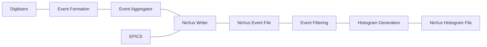

# Data Processing Pipeline

The data processing pipeline is defined as the data path between data collection and production of a NeXus histogram file equivalent to what existing muon instruments produce.
This is split into two broad categories: acquisition & online processing and offline processing.

## Acquisition & Online Processing

The online stage of the pipeline exists between the digitisers and instrument control program and the NeXus file that is written to the archive.
This physically exists on compute within the instrument cabin.

The online data pipeline is designed around a centralised data broker, with several small data processing units, each taking data from and providing data to the broker.

### Event Formation

This is the stage that transforms raw detector traces into event lists.

[Source and documentation](https://github.com/STFC-ICD-Research-and-Design/supermusr-data-pipeline/tree/main/trace-to-events).

### Event Aggregator

This component aggregates the ~128 event list messages for each digitiser for a given frame into a single event list message per frame.
Aggregation is performed using the status packet as a key, therefore any fault upstream of the status packet generation or in the transmission of the status packet will cause either controlled data loss or undefined behaviour in this component.

[Source and documentation](https://github.com/STFC-ICD-Research-and-Design/supermusr-data-pipeline/tree/main/digitiser-aggregator).

### NeXus Writer

This writes NeXus event files with information sourced from:

- Run control messages
- The per frame aggregated event list messages
- EPICS sample environment/process logs

[Source and documentation](https://github.com/STFC-ICD-Research-and-Design/supermusr-data-pipeline/tree/main/nexus-writer).

## Offline Processing

The offline stage of the pipeline includes any processing that is done using the written event NeXus file as the input.
This may happen anywhere within reason, but most likely will be done on IDAAas.

[Source](https://github.com/ISISMuon/MuonDataLib).
