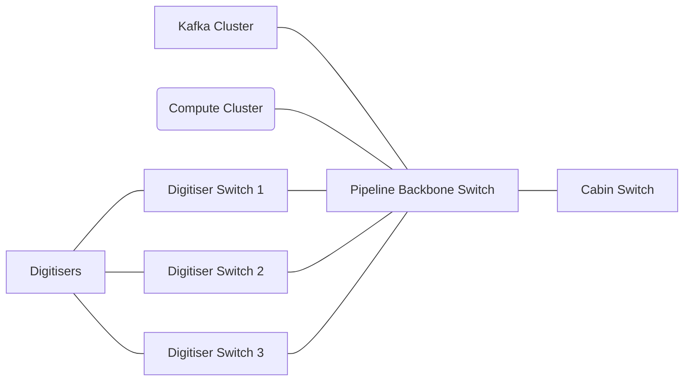

# Networking

## Assumptions

- Per DAQ throughput of 10 Mb/s (assuming compression and safety margin)
- Kafka replication factor = 1
- Quantity of nodes for Redpanda broker and compute cluster are unlikely to change, but also not set in stone

## Digitisers

- 32 units x 4 DAQ each = 128 GbE ports
- 3 x 48 GbE port switches = 144 available GbE ports
- 43 DAQ per switch

## Pipeline

### Digitiser uplinks

- 1x 10 GbE uplink per digitiser switch
- 3 switches x 1 link per switch = 3 links

### Kafka links

- 1x 10 GbE link per redpanda node
- 5 nodes x 1 link per node = 5 links

### Compute links

- 5 nodes x 1 link per node = 5 links

### Totals

10 Gbps links: 3 + 5 + 5 + 1 (uplink) = 14

24 ports would be ideal to allow for possible expansion.
