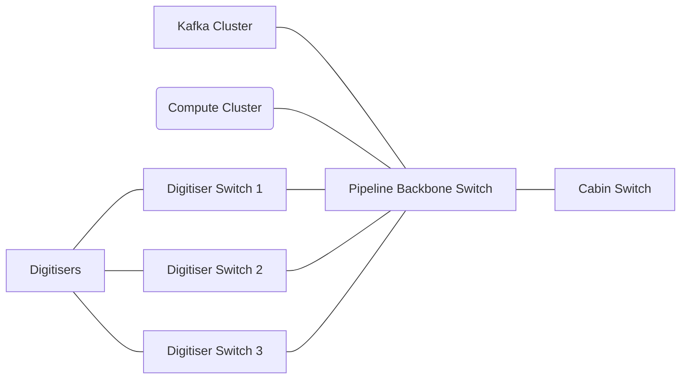

# Networking

## Digitisers

https://www.fs.com/uk/products/134657.html

### Port count

32 Units x 4 DAQ each = 128 GBE ports

3 x 48 GBE port switches = 144 available GBE ports

43 DAQ per switch

### Switch throughput

Observed (on HIFI): throughput of 8xDAQ at Kafka broker ~= 850Mbps (at 20ms acquisition length)

Double to account for desired acquisition length + some safety margin = 1.7Gbps / 8 DAQ

Assuming 43 DAQ per switch: switch uplink = ~10 Gbps

Total uplink throughput = 3 x ~10 Gbps = 30 Gbps

Total switch throughput = ~30 Gbps

## Pipeline

https://www.fs.com/uk/products/122280.html

https://www.fs.com/uk/products/29123.html

### Digitiser uplinks

2x 10Gbps per switch = 20 Gbps per switch

3 switches x 2 links per switch = 6 links

### Kafka links

Require, in both directions, trace data bandwidth plus pipeline bandwidth plus some overhead

Trace data distributed across nodes

Bandwidth per node = 30 Gbps / 3 = 10 Gbps, plus overhead = 20 Gbps = 2 x 10 Gbps links per node

3 nodes x 2 links per node = 6 links

### Compute links

Require trace data bandwidth (Rx) plus pipeline bandwidth (Tx) plus some overhead

Trace data distributed across nodes

Bandwidth per node = 30 Gbps / 3 = 10 Gbps, plus overhead = 20 Gbps = 2 x 10 Gbps links per node

3 nodes x 2 links per node = 6 links

### Totals

10 Gbps links: 6 + 6 + 6 + 1 (uplink) = 20

Switch throughput: (3 x 20) + (3 x 30) + (3 x 20) + 5 = 60 + 90 + 60 + 5 = 210 Gbps
